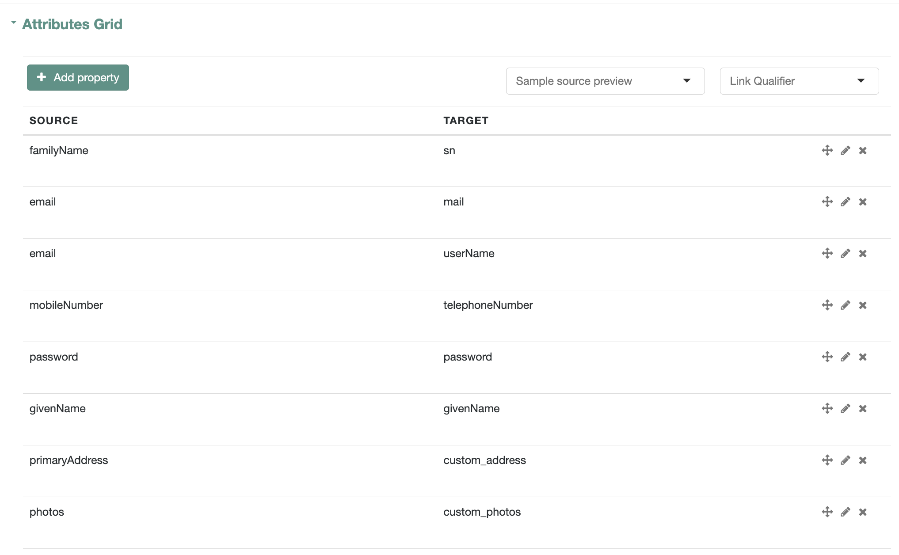

<!--
 * The contents of this file are subject to the terms of the Common Development and
 * Distribution License (the License). You may not use this file except in compliance with the
 * License.
 *
 * You can obtain a copy of the License at legal/CDDLv1.0.txt. See the License for the
 * specific language governing permission and limitations under the License.
 *
 * When distributing Covered Software, include this CDDL Header Notice in each file and include
 * the License file at legal/CDDLv1.0.txt. If applicable, add the following below the CDDL
 * Header, with the fields enclosed by brackets [] replaced by your own identifying
 * information: "Portions copyright [year] [name of copyright owner]".
 *
 * Copyright 2022 ForgeRock AS.
-->
# Akamai Identity Cloud RCS Connector

Akamai Identity Cloud RCS Connector for synchronization between Akamai Identity Cloud and PingIDM / PingOne AIC.

**Connector Features:**
- Bidirectional synchronization (Akamai Identity Cloud ↔ PingOne IDM)
- Password migration
- Full support for custom attributes

 

**Note:** Custom attributes must be defined in both Akamai Identity Cloud and the PingOne IDM Native Console to be mapped and synchronized successfully.

## Setup

Install and setup the Java RCS: https://backstage.forgerock.com/docs/openicf/latest/connector-reference/java-server.html

Once Java RCS openicf is downloaded, create a tools directory in the openicf directory. Place these groovy scripts in this tools directory.

There are also 3 libraries that need to be installed. These are called secrets-api, chf-http-core, and json-web-token. These can be installed in the /lib/framework directory of openicf. These jar files can be found by installing the latest of openidm, and finding those dependencies in the openidm/bundle folder. OpenIDM installation can be found here: https://backstage.forgerock.com/downloads/browse/idm/featured

For on-premises installations, follow these steps here: https://docs.pingidentity.com/pingidm/7.2/connector-reference/configure-connector.html#connector-wiz-REST.

## Configurations

Using the Platform UI, go to applications and browse app catalog. Select the Scripted Rest Connector.  

After creating the connector, set these configurations:

<table>
<thead>
<th>Property</th>
<th>Usage</th>
</thead>
<tr>
    <td>Service Address</td>
    <td>${Akamai Tenant URL}</td>
</tr>
<tr>
    <td>Proxy Address</td>
    <td></td>
</tr>
<tr>
    <td>Username</td>
    <td>${Basic Auth Username}</td>
</tr>
<tr>
    <td>Password</td>
    <td>${Basic Auth password}</td>
</tr>
<tr>
    <td>Default Content Type</td>
    <td></td>
</tr>
<tr>
    <td>Default Request Headers</td>
    <td></td>
</tr>
<tr>
    <td>Default Authentication Method</td>
    <td>BASIC</td>
</tr>
<tr>
    <td>Custom Sensitive Configuration</td>
    <td></td>
</tr>
<tr>
    <td>Script Roots</td>
    <td>tools/</td>
</tr>
<tr>
    <td>Authenticate Script</td>
    <td></td>
</tr>
<tr>
    <td>Create Script</td>
    <td>CreateScript.groovy</td>
</tr>
<tr>
    <td>Update Script</td>
    <td>UpdateScript.groovy</td>
</tr>
<tr>
    <td>Delete Script</td>
    <td>DeleteScript.groovy</td>
</tr>
<tr>
    <td>Search Script</td>
    <td>SearchScript.groovy</td>
</tr>
<tr>
    <td>Test Script</td>
    <td></td>
</tr>
<tr>
    <td>Sync Script</td>
    <td></td>
</tr>
<tr>
    <td>Schema Script</td>
    <td>SchemaScript.groovy</td>
</tr>
<tr>
    <td>Resolve Username Script Script</td>
    <td></td>
</tr>
<tr>
    <td>Script On Resource Script</td>
    <td></td>
</tr>
<tr>
    <td>Customizer Script</td>
    <td>CustomizerScript.groovy</td>
</tr>
</table>

## Basic Mappings

**Akamai Identity Cloud → PingIDM:**
- In the Native Console, go to **Identity Management > Configure > Mappings**.
- Create a new mapping.
- Set the **Akamai Scripted REST Connector** as the *source* and the desired **PingIDM managed object** as the *target*.

 

**PingIDM → Akamai Identity Cloud:**
- In the Native Console, go to **Identity Management > Configure > Mappings**.
- Create a new mapping.
- Set the desired **PingIDM managed object** as the *source* and the **Akamai Scripted REST Connector** as the *target*.

After creating the mapping in either direction, you can configure property mappings to define which attributes synchronize between Akamai and PingIDM.

Example property mapping configuration:

### Supported Attributes
The Akamai connector supports all standard Akamai Identity Cloud attributes as well as custom attributes defined in your Akamai schema.
- To synchronize custom attributes from Akamai Identity Cloud into PingIDM, you must first define the corresponding custom attributes in IDM.

 

**Note:** It is recommended that all schema attribute policies are turned off in order to avoid attribute mapping complications.

<!-- SUPPORT -->
## Support

If you encounter any issues, be sure to check our **[Troubleshooting](https://backstage.forgerock.com/knowledge/kb/article/a68547609)** pages.

Support tickets can be raised whenever you need our assistance; here are some examples of when it is appropriate to open a ticket (but not limited to):

* Suspected bugs or problems with Ping Identity software.
* Requests for assistance 

You can raise a ticket using **[BackStage](https://backstage.forgerock.com/support/tickets)**, our customer support portal that provides one stop access to Ping Identity services.

BackStage shows all currently open support tickets and allows you to raise a new one by clicking **New Ticket**.

<!------------------------------------------------------------------------------------------------------------------------------------>
<!-- COLLABORATION -->

## Contributing

This Ping Identity project does not accept third-party code submissions.

<!------------------------------------------------------------------------------------------------------------------------------------>
<!-- LEGAL -->

## Disclaimer

> **This code is provided by Ping Identity on an “as is” basis, without warranty of any kind, to the fullest extent permitted by law.
>Ping Identity does not represent or warrant or make any guarantee regarding the use of this code or the accuracy,
>timeliness or completeness of any data or information relating to this code, and Ping Identity hereby disclaims all warranties whether express,
>or implied or statutory, including without limitation the implied warranties of merchantability, fitness for a particular purpose,
>and any warranty of non-infringement. Ping Identity shall not have any liability arising out of or related to any use,
>implementation or configuration of this code, including but not limited to use for any commercial purpose.
>Any action or suit relating to the use of the code may be brought only in the courts of a jurisdiction wherein
>Ping Identity resides or in which Ping Identity conducts its primary business, and under the laws of that jurisdiction excluding its conflict-of-law provisions.**

<!------------------------------------------------------------------------------------------------------------------------------------>
<!-- LICENSE - Links to the MIT LICENSE file in each repo. -->

## License

This project is licensed under the MIT License - see the [LICENSE](LICENSE) file for details

---

&copy; Copyright 2024 Ping Identity. All Rights Reserved

[pingidentity-logo]: https://www.pingidentity.com/content/dam/picr/nav/Ping-Logo-2.svg "Ping Identity Logo"
